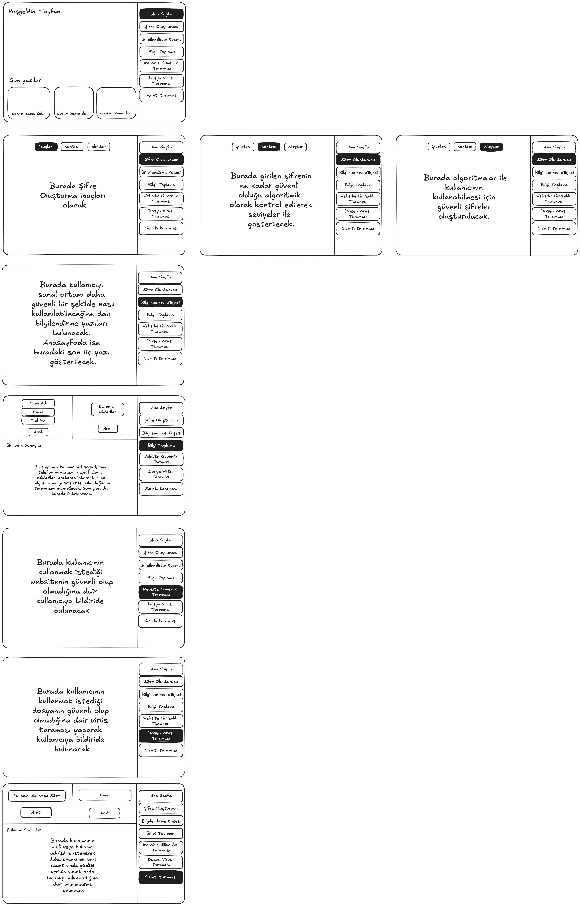

# Güven Çemberi (Circle of Trust)

- [**Proje Videosu**](https://www.youtube.com/watch?v=7OTL2Mjah1k)
- [**Proje Sunumu**](https://docs.google.com/presentation/d/1tqpqM84IdU64_DmL8nrL2Jv9RdvbyPCxsMey9rD03ho/edit?usp=sharing)
- [**Proje Tezi**](https://docs.google.com/document/d/1effYaKRQ1Agthgu47bGZzezxNtj29p3XkNpVq1MqeHo/edit?usp=sharing)
- [**Proje Kodları**](https://github.com/tyfnacici/guven-cemberi)

## Kullanılan Teknolojiler

- **Frontend**: Next.js, Tailwind CSS, React Native
- **Backend**: Dockerde çalışan Flask Backend
- **Kütüphaneler**: React Native WebView, Expo, crypto-js, papaparse, eslint
- **Yazılım Dilleri**: JavaScript, TypeScript, Python

## Proje Tanımı

- Siber güvenlik, günümüz dünyasında bireyler ve kurumlar için hayati önem taşımaktadır. Her geçen gün artan dijitalleşme, bireylerin ve kurumların kişisel ve kurumsal verilerini daha büyük tehditler altına sokmaktadır. Bununla birlikte, bireylerin kişisel verilerini korumak ve dijital güvenliklerini sağlamak için kullanabilecekleri araçlar genellikle kurumsal çözümlere kıyasla sınırlı ve karmaşıktır. Bu araştırma önerisi, bireylerin siber güvenlik ihtiyaçlarını karşılayacak, kullanımı kolay ve çok yönlü bir platform geliştirme fikrine dayanmaktadır.

- Bu projenin özgün değeri, bireylerin günlük yaşamlarında siber güvenliklerini sağlamak için ihtiyaç duydukları araçları tek bir platformda toplamaktır. Mevcut literatürde bireysel kullanıcıların siber güvenlik ihtiyaçlarına yönelik çözümler sınırlıdır ve bu boşluğu doldurmayı amaçlamaktayım. Çoğu çalışma, genellikle kurumsal güvenliğe odaklanmakta olup, bireysel kullanıcıların ihtiyaçlarını göz ardı etmektedir. Bu bağlamda, geliştirilecek platform, kişisel veri güvenliğini sağlayacak araçlar sunarak kullanıcılara ve literatüre önemli bir katkı sağlayacaktır. 

## Proje Diagramı

## Proje Amaçları ve Hedefleri 

- Bu projenin temel amacı, bireysel kullanıcıların siber güvenlik ihtiyaçlarını karşılayan, kullanımı kolay ve kapsamlı bir platform geliştirmektir. Bu ana amaç doğrultusunda, bir dizi spesifik hedef belirlenmiştir. Öncelikle, proje süresi boyunca kullanıcıların kişisel verilerini internette tarayabilen ve bu verilerin paylaşıldığı site adreslerini listeleyebilen bir "Bilgi Toplama" aracı geliştirilecektir. Bunu takiben, kullanıcıların e-posta adreslerinin kayıtlı olduğu sitelerde veri sızıntısı yaşanıp yaşanmadığını kontrol edebilen bir "E-posta Veri Sızıntısı Kontrolü" modülü oluşturulacaktır.

- Güven Çemberi Projemin bir diğer önemli hedefi, kullanıcılara güvenli şifre oluşturma, şifre güvenlik seviyesi ölçme ve otomatik güvenli şifre üretme özellikleri sunan bir "Şifre Yöneticisi" geliştirmek ve bunu popüler şifre yöneticileri ile entegre etmektir. Ayrıca, siber güvenlik, siber zorbalık, hacker türleri ve dijital dünyadaki yasal haklar gibi önemli konularda kullanıcıları bilgilendiren bir "Bilgilendirme Köşesi" tasarlanacaktır. Kullanıcıların ziyaret ettikleri web sitelerinin güvenliğini tarayabilen ve olası phishing saldırılarına karşı uyarı verebilen bir "Site Güvenlik Taraması" aracı ile şüpheli dosyaları kötü amaçlı yazılımlara karşı tarayabileceği bir "Dosya Güvenlik Taraması" özelliği de platformun önemli bileşenleri olacaktır.

- Proje kapsamında, tüm bu özellikleri içeren bir web uygulaması geliştirilecek ve kullanıma sunulacaktır. Web uygulamasının tamamlanmasının ardından, aynı özellikleri içeren bir mobil uygulama geliştirme süreci başlatılacaktır. Ayrıca, kullanıcılara şifre oluşturma modülüne doğrudan erişim sağlayan ve ziyaret edilen web sitelerinin güvenlik durumunu gerçek zamanlı olarak kontrol eden bir tarayıcı eklentisi geliştirilecektir.

## İhtiyaç Analizi

- Güven Çemberi projem, günümüz dijital dünyasında bireylerin karşılaştığı siber güvenlik tehditlerine karşı daha etkili ve kullanıcı dostu çözümler sunma amacıyla tasarlanmıştır. İnternet kullanımının artması, bireylerin kişisel verilerini daha fazla paylaşmasına neden olmuş ve bu durum da bireysel düzeyde siber güvenliğin önemini büyük ölçüde artırmıştır. Siber saldırılar, kimlik avı (phishing), veri sızıntıları, zayıf şifre kullanımı ve zararlı yazılımlar bireyleri tehdit eden en yaygın sorunlar arasındadır. Bu bağlamda, bireylerin kendi siber güvenliklerini sağlamalarına yardımcı olacak kapsamlı ve entegre bir araç ihtiyacı doğmuştur.

1. Veri Sızıntılarının Artması
  Günümüzde birçok birey, farkında olmadan veri sızıntılarına maruz kalmaktadır. E-posta adresleri, şifreler, kişisel bilgiler gibi hassas veriler, büyük şirketlerin veri tabanlarına yapılan saldırılar sonucunda ifşa edilebilmektedir. Bireyler genellikle bu tür sızıntılardan habersizdir ve hangi verilerinin çalındığını bilmeleri zorlaşmaktadır. Bu nedenle, kullanıcıların e-posta adreslerini ve diğer kişisel bilgilerini tarayarak bir veri sızıntısında yer alıp almadıklarını belirleyen bir modüle ihtiyaç vardır.

2. Zayıf Şifre Yönetimi
  Birçok kullanıcı, birden fazla çevrimiçi platformda aynı şifreyi kullanma eğilimindedir. Bu durum, herhangi bir platformda şifrelerin ele geçirilmesi halinde, tüm hesaplarının tehlikeye girmesine neden olabilir. Güçlü ve benzersiz şifreler oluşturmak, şifrelerin düzenli olarak güncellenmesini sağlamak ve güvenli bir şekilde saklanmasını temin etmek bireyler için kritik bir ihtiyaçtır. Bu yüzden, bireylerin güvenli şifreler oluşturabilmelerini, şifrelerini saklayabilmelerini ve gerektiğinde otomatik olarak şifrelerini değiştirebilmelerini sağlayacak bir şifre yönetim aracına ihtiyaç duyulmaktadır.

3. Kötü Amaçlı Yazılımlar ve Dosya Güvenliği
  Bireyler sıklıkla bilinçsiz bir şekilde zararlı yazılımlar içeren dosyaları indirir veya çalıştırır. Bu dosyalar kişisel bilgilerin çalınmasına, cihazların bozulmasına veya kullanılamaz hale gelmesine neden olabilir. Dolayısıyla, kullanıcıların dosyalarını düzenli olarak tarayabilecekleri, zararlı yazılımları tespit edebilecekleri ve bu yazılımlara karşı kendilerini koruyabilecekleri bir dosya güvenlik tarayıcısına ihtiyaç vardır.

4. Kullanıcı Dostu ve Entegre Bir Platform Eksikliği
  Mevcut siber güvenlik araçlarının birçoğu birbirinden bağımsız olarak çalışmakta ve farklı alanlarda uzmanlaşmış durumdadır. Örneğin, şifre yöneticisi ayrı bir araçken, veri sızıntısı tespit araçları başka bir platformda sunulmaktadır. Bu durum, bireylerin farklı güvenlik ihtiyaçlarını karşılayabilmek için birden fazla aracı kullanmalarını gerektirmekte ve kullanıcı deneyimini olumsuz etkilemektedir. Dolayısıyla, tüm bu siber güvenlik çözümlerini tek bir platformda sunarak, kullanıcıların daha etkin bir şekilde siber güvenliklerini yönetmelerini sağlayacak bir çözüm ihtiyacı bulunmaktadır.

5. Kişisel Farkındalık ve Eğitim İhtiyacı
  Birçok birey siber güvenlik tehditlerinin farkında değildir ve siber güvenlik uygulamalarını hayatlarına nasıl entegre edecekleri konusunda yeterli bilgiye sahip değildir. Kimlik avı saldırılarına, zararlı yazılımlara veya veri ihlallerine karşı önleyici tedbirler almadıkları için, bu tehditlerin mağduru olmaktadırlar. Kullanıcıların siber güvenlik farkındalığını artırmak amacıyla onlara bilgi veren ve gerektiğinde uyarılar gönderen bir eğitim ve bilgilendirme modülüne ihtiyaç duyulmaktadır.

  Sonuç olarak Güven Çemberi projem, bireylerin çevrimiçi dünyadaki güvenlik ihtiyaçlarını karşılayabilmek için tasarlanmış kapsamlı bir çözüm sunmayı hedeflemektedir. Bireylerin güçlü şifreler oluşturmasını sağlayan, veri sızıntılarını tespit edebilen, dosya güvenliği konusunda rehberlik sunan ve tüm bu hizmetleri kullanıcı dostu bir platformda toplayan bir sistem ihtiyacı bulunmaktadır. Bu proje, kullanıcıların dijital dünyadaki güvenliklerini artırmalarını sağlarken, aynı zamanda bilinçli birer internet kullanıcısı olmalarına da katkı sağlayacaktır.

## Proje Mimarisi 

- Donanım Mimarisi ve Yazılım Platformu:
  Proje, Docker konteynerları içerisinde Linux işletim sistemi üzerinde çalışacaktır. Bu, uygulamanın taşınabilirliğini ve ölçeklenebilirliğini artıracaktır. Tüm gerekli araçlar ve servisler tek bir Docker konteynerı içerisinde barındırılacak, böylece dağıtık bir mimari yerine monolitik bir yapı tercih edilecektir.

- Programlama Dili ve Framework:
  Backend için Flask kullanılacak, bu da Python tabanlı bir sunucu ortamı sağlayacaktır. TypeScript, tip güvenliği ve gelişmiş IDE desteği için tercih edilecektir. Frontend geliştirmesi için Next.js framework'ü kullanılacak, bu da React tabanlı, server-side rendering ve statik site oluşturma özelliklerini beraberinde getirecektir. CSS framework'ü olarak Tailwind CSS kullanılarak hızlı ve özelleştirilebilir bir tasarım süreci sağlanacaktır.

- Veri Tabanı Mimarisi ve Teknolojisi:
  Projede kalıcı bir veritabanı kullanılmayacaktır. Bunun yerine, kullanıcı verileri session olarak tutulacak ve kriptografik algoritmalar kullanılarak hashlenecektir. Bu yaklaşım, kullanıcı gizliliğini artıracak ve veri sızıntısı riskini minimize edecektir.

- Mobil Ekran Tasarımı ve Web Tasarımı:
  Mobil uygulama için React Native kullanılacak ve WebView teknolojisi ile web uygulaması mobil ortamda görüntülenecektir. Bu yaklaşım, tek bir kod tabanı ile hem web hem de mobil platformları desteklemeye olanak tanıyacaktır. Web tasarımı, responsive bir yaklaşımla geliştirilecek ve Tailwind CSS kullanılarak hem masaüstü hem de mobil cihazlarda optimal kullanıcı deneyimi sağlanacaktır.

- Eklenti Geliştirme Yazılım Teknolojileri:
  Tarayıcı eklentisi, JavaScript kullanılarak hali hazırda javascript/typescript dilleri ile geliştirilen mimari sayesinde projedeki diğer modüllere uyumlu bir şekilde tasarlanacaktır.

- Siber Güvenlik, Şifre Önerme ve Saklama Teknikleri:
  Şifre önerme işlemi için güçlü kriptografik rastgele sayı üreticileri kullanılacaktır. Oluşturulan şifreler, session içerisinde AES-256 gibi güçlü bir şifreleme algoritması kullanılarak saklanacaktır. Kullanıcılar, oluşturdukları şifreleri .csv formatında dışa aktarabilecek, böylece diğer şifre yöneticileri ile entegrasyon sağlanabilecektir.

  Yazılım mimarisi olarak, RESTful API'ler kullanılarak web uygulaması ve tarayıcı eklentisi arasında veri alışverişi sağlanacaktır. Flask ile yazılacak API'ler, Docker içerisindeki Linux araçlarına post request göndererek işlemleri gerçekleştirecek ve sonuçları döndürecektir. Gerekli diğer veriler, harici API'ler aracılığıyla projeye çekilecektir.